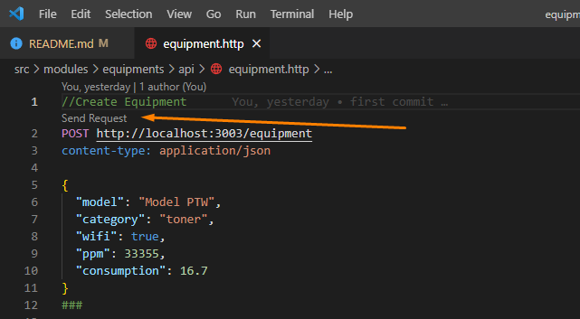

# Backend Challange - Venturus

# Description

Create the CRUD endpoints to the bellow entity:

**Equipment**

```javascript
{
    model: string,
    category: enum ("cartucho" | "toner"),
    ppm: integer (0 to 999999),
    wifi: boolean,
    consumption: number (0 to 999999)
}
```

**Required**: model, category


The test should be done using:

- Database: sqlite3
- Back-end: Node.js
- Source code in english

</br>


## Infrastructure

- NodeJS backend using NestJs Framework and Typescript
- Jest as the testing framework
- Swagger
- NestJS Logger

### Test files:

- files `.spec.ts` - unit tests
- files `.e2e-spec.ts` - end to end tests

</br>

### Setup

1. clone the git repository
1. run `yarn install`
1. run `npm start` to start the aplication

</br>

## Tests
### To run the tests

1. open the terminal and run the command of the chosen test type:

- to run all tests: `npm run test` 
- to run unit tests: `npm run test:unit`
- to run end to end tests: `npm run test:e2e`

###  Testing the API using REST Client ##

If using VSCode, inside src/modules/module-name/api, you may find `.http` files that works with the extension **REST Client**

https://marketplace.visualstudio.com/items?itemName=humao.rest-client

1. Install the extension
1. Start the aplication
1. Open the .http file
1. Click send (replace the id when necessary)




</br>

## Functionalities

- [Create Equipment](docs/equipment-create.md)
- [List Equipments](docs/equipment-update.md)
- [Uptade Equipment](docs/equipment-list.md)
- [Delete Equipment](docs/equipment-update.md)

### Swagger

Access http://localhost:3000/docs to view swagger documentation.

</br>

## Architecture

I've used clean architecture with concepts of "Domain Driven Design" (which is a design tool and not an architecture). I've separated the context by components (modules), which also follow NestJS standards. This module separation has an monolitic backend-api in mind, wich can be easily expanded. For a micro-service (with a single context), i would bring everyting inside the modules folder foward, separating the content on their corresponding layers.

The services (usecases) contains the business rules of the application.


